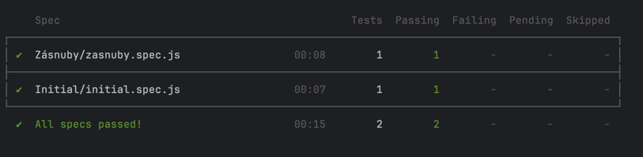

# YellowMedia-test

This is a home task for Yellow Media.

### How to setup

1. Clone repository
2. Install dependecies using command `npn install`
3. Create `cypress.env.json` file in the root of project and setup base url.

    Example of `cypress.env.json`:
   `
   {
   "baseUrl": "https://google.com"
   }
   `

   More info about cypress env you could read [here](https://docs.cypress.io/guides/guides/environment-variables#Option-2-cypressenvjson)
4. Execute test by `npm run e2e`\
    If you need to run in headless mode run `nom run e2e-headless`
5. Check results

## Results

